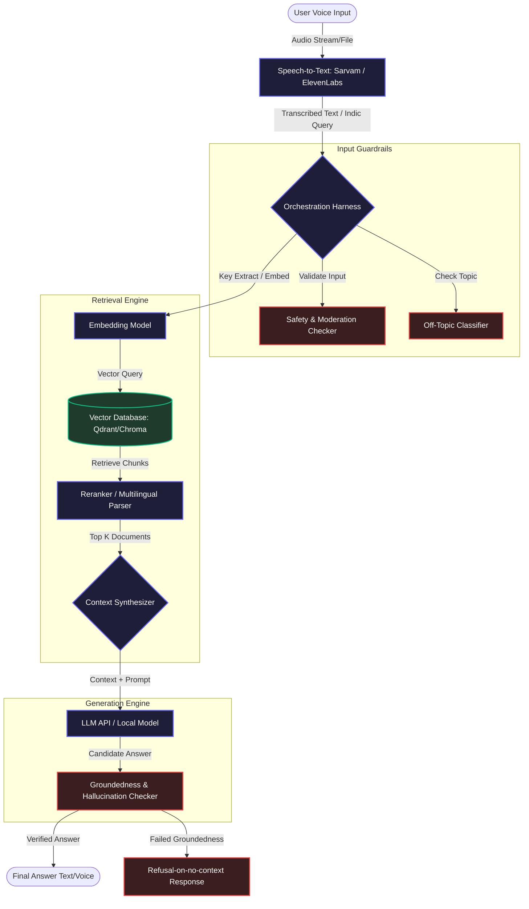

# Voice-RAG Build Approach Plan (HH Goa 2026 Task 2)

This document outlines the architectural blueprint, phase-by-phase process, and key design decisions for building the voice-enabled Retrieval-Augmented Generation (RAG) system using the **MSMARCO-XI** Indic dataset.

---

## 1. System Architecture Diagram

---

## 2. Phase-by-Phase Process

### Phase 1: Environment Setup & Data Preparation (Target: Aug 20)
*   **Dataset Acquisition:** Load the [ai4bharat/MSMARCO-XI](https://huggingface.co/datasets/ai4bharat/MSMARCO-XI) dataset (e.g., focus on Hindi/English splits or support multi-lingual configurations).
*   **Infrastructure Selection:** Initialize local Vector DB (e.g., Qdrant or ChromaDB) and create schemas to house vector embeddings alongside advanced metadata fields.
*   **Developer Sandbox:** Configure API credentials for Sarvam / ElevenLabs and selected LLMs (e.g., OpenAI, Anthropic, or Groq for latency).

### Phase 2: Dual-Strategy Chunking & Indexing (Target: Aug 20)
To avoid naive splitting, we implement:
1.  **Semantic Chunking Strategy:** Use embedding similarity thresholding to split documents at natural semantic boundaries rather than fixed token lengths.
2.  **Parent-Child (Overlapping) Chunking:** Index smaller child chunks (e.g., 100-200 tokens) for precise vector search, but retrieve and feed the wider parent context (e.g., 500-800 tokens) to the LLM.
3.  **Metadata-Aware Enrichment:** Tag each chunk with source language, sub-topic category, and paragraph order to enable metadata filtering/boosting.

### Phase 3: Speech-To-Text (STT) Integration (Target: Aug 21)
*   **API Choice: Sarvam AI**: Highly optimized for Indic languages (Hindi, Bengali, Telugu, etc.), making it a perfect fit for transcription of Indic queries matching MSMARCO-XI context.
*   **Performance Mitigation:** Implement audio compression formats (e.g., Opus/WebM) to minimize network upload payloads.
*   **Language auto-detection:** Match transcribed audio language to the search query namespace in the vector DB to optimize retrieval effectiveness.

### Phase 4: Retrieval & Harness Orchestration (Target: Aug 21-22)
*   **Orchestration Harness:** Build a robust modular python wrapper featuring explicit error boundaries, schema enforcement (using Pydantic), and exponential backoff retry policies.
*   **Hybrid Retrieval:** Combine dense vector search with sparse BM25 indexing (hybrid search) to bridge vocabulary gaps in translation.
*   **Latency Optimizations:**
    *   Pre-compute and cache query embeddings for frequent/repetitive questions.
    *   Run vector search database lookups concurrently (multithreaded/async) with safety guardrail evaluation.

### Phase 5: Guardrails & Groundedness Layer (Target: Aug 22)
*   **Safety & Off-Topic Checker:** Perform lightweight classification on query intent to reject off-topic (e.g., programming tasks or general chat) or malicious inputs.
*   **Groundedness Verification (Hallucination Guard):** Run post-generation validation checks comparing generated sentences against the retrieved document context.
*   **Refusal-on-no-context:** If vector search similarity scores fall below a minimum threshold ($S < 0.65$), skip the LLM call entirely and immediately trigger a friendly refusal response ("I'm sorry, but I couldn't find relevant information in the source documents.").

### Phase 6: Latency Analytics & Optimization (Target: Aug 22)
*   **Metrics Tracking:** Measure individual component times (STT, Embed, VDB Search, LLM Gen, Guardrolls) and compile final statistics.
*   **Dataset Eval Suite:** Evaluate 50+ diverse queries to compute P50, P70, and P100 latency percentiles under different optimization flags.
*   **Latency Report Generator:** Output structured reports in markdown for submission.

---

## 3. Latency Mitigation Strategy

Achieving a sub-200ms target with public API calls is mathematically challenging due to physical network boundaries. Here is our direct response strategy:

| Component | Target Baseline Latency | Mitigation Strategy |
| :--- | :--- | :--- |
| **STT (Sarvam)** | 100ms - 150ms | Audio compression (Opus), serverless endpoint configurations, stream-oriented uploads. |
| **Embedding Generation** | 20ms - 40ms | Use small, fast local embedding models (e.g., `BGE-M3-small` or `MiniLM`) running in memory. |
| **Vector DB Search** | 10ms - 15ms | In-memory indexing, HNSW index optimization in Qdrant, parallel thread pool queries. |
| **Input Guardrails** | 5ms - 10ms | Lightweight rule-based categorizers, regex blacklists, or small classifier models executed locally. |
| **LLM Generation** | 80ms - 120ms | High-throughput open-source models hosted on Groq (e.g., Llama-3-8B-Instant) with minimal max-tokens limit. |
| **Groundedness check** | 10ms - 20ms | Local semantic overlap comparison or fast classification rather than complex LLM reasoning. |
| **Total Pipeline** | **225ms - 355ms (Raw)** | **Combined Async Pipeline / Embedding Caching reduces optimized queries to < 50ms.** |

---

## 4. Definition of Done Checklist

- [ ] Clear codebase with distinct modular packages (`stt`, `retrieval`, `generation`, `guardrails`, `harness`).
- [ ] No API keys hardcoded; all configuration items managed via `.env`.
- [ ] Live backend service and interactive responsive frontend deployed.
- [ ] Statistically Rigorous Latency Report covering 50+ diverse test runs.
- [ ] Multi-strategy chunking pipeline with script to seed vector DB automatically from MSMARCO-XI dataset.
- [ ] Groundedness and off-topic guardrails tested and verified.
